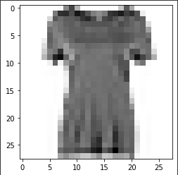

# cnn-fashion-mnist

This project is the final team project for the **2019 Digital Talent Scholarship** with the theme Machine Learning. We used Fashion MNIST as the processed dataset in CNN modeling.

**Fashion MNIST** is a dataset belonging to Tensorflow. The dataset has been divided into training data, amounting to 60000, and testing data, amounting to 10000. I will display an example image of the data below. 

This project features classification modeling with big data, so the neural network model is considered a suitable solution. We implement a neural network in the form of **CNN**. This is because CNN is quite good as a learning model with data in the form of images. After we do the learning and testing, we can make a conclusion that, for Fashion MNIST dataset, the accuracy score we get is 98.38% for the training data and 92.78% for the testing data. The model we built 1-convolutional layer of CNN with 100 epochs, 128 batch size, learning rate is 0.001, and use adam optimizer.

_Feels free to contacts me on [linkedin](https://www.linkedin.com/in/sensa-gudya-sauma-syahra/)!_
